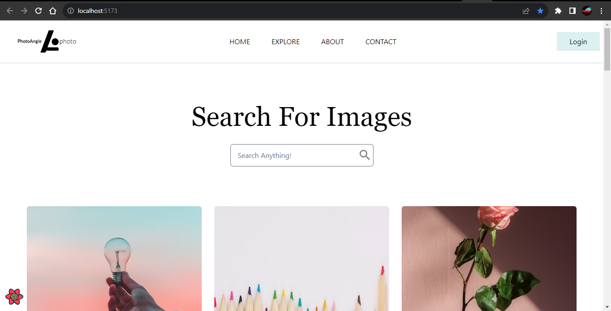

# Image-Search-Gallery

### Simple Image Search Webapp that uses unsplash api to fetch images upon queries.
### This React Application uses reactQuery for fetching and context api for state management

### To Run the Application
#### Step 1. Enter the following code in terminal
    yarn install
### Step 2.
    npm run dev
or
### Run the following code 
    npm install -g vite
### and then 
    vite
